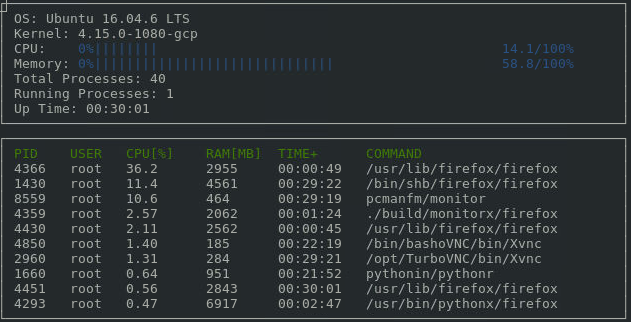

# System-Monitor Project

This project shows the development of a System Monitor for Linux, similar to the well-known *htop* command-line tool. The idea was based on the Object Oriented Programming Course of the [Udacity C++ Nanodegree Program](https://www.udacity.com/course/c-plus-plus-nanodegree--nd213). The starter code structure is provide on [Github](https://github.com/udacity/CppND-System-Monitor).

In the following screenshot, a sample output of the System Monitor is shown.

## Linux Workspace
Currently, the project only supports Linux operating systems. The code was developed and tested under *Ubuntu 16.04.6*.

## Visualization Library ncurses
[ncurses](https://www.gnu.org/software/ncurses/) is a library that facilitates text-based graphical output in the terminal. This project relies on ncurses for display output.

If you do not have ncurses setup already, install ncurses within your own Linux environment: `sudo apt install libncurses5-dev libncursesw5-dev`

## Make
This project uses [Make](https://www.gnu.org/software/make/). The Makefile has four targets:
* `build` compiles the source code and generates an executable
* `format` applies [ClangFormat](https://clang.llvm.org/docs/ClangFormat.html) to style the source code
* `debug` compiles the source code and generates an executable, including debugging symbols
* `clean` deletes the `build/` directory, including all of the build artifacts